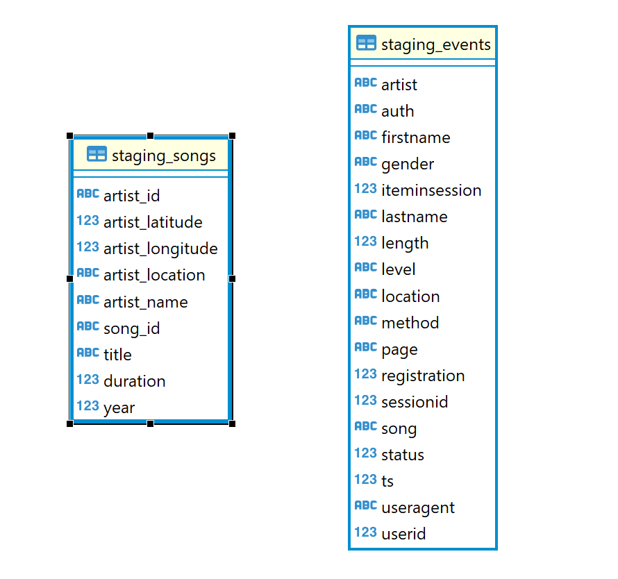

# Udacity Data Engineering Nanodegree - Project 5: Sparkfy Data Pipelines

## Description

A music streaming company, Sparkify, has decided that it is time to introduce more automation and monitoring to their data warehouse ETL pipelines and come to the conclusion that the best tool to achieve this is Apache Airflow.

They have decided to bring you into the project and expect you to create high grade data pipelines that are dynamic and built from reusable tasks, can be monitored, and allow easy backfills. They have also noted that the data quality plays a big part when analyses are executed on top the data warehouse and want to run tests against their datasets after the ETL steps have been executed to catch any discrepancies in the datasets.

The source data resides in S3 and needs to be processed in Sparkify's data warehouse in Amazon Redshift. The source datasets consist of JSON logs that tell about user activity in the application and JSON metadata about the songs the users listen to.

## Database design

The database designed implements a star schema, with 1 fact table and 4 dimensions. Our fact table `songplays` is the event of playing a song by any user, meanwhile the dimensions are:
* `users` - Contains user information such as name, gender, and subscription type (paid or free)
* `artists` - Contains artists information such as name, location
* `songs` - Contains songs information such as title, artist id, duration, year
* `time` - Contains timestamp information and its associated data, such as month, week, day, weekday, year, and hour
 

_*Datbase schema close up to final tables.*_

In the same database, we implemented the staging tables, to be used during the ingestion process of json data from S3 buckets. The tables design is available in the image below:

_*Datbase schema close up to staging tables.*_

## Files Structure

* `udac_example_dag.py` - DAG setup
* `create_tables.sql` - contains the SQL queries used to create the required tables in Redshift
* `sql_queries.py` - contains the SQL queries used in the ETL process. It should be placed in the `plugins/helpers` directory of your Airflow installation.

For this project, personalized operators were created and they need to be placed in the `plugins/operators` directory of your Airflow installation:
* `stage_redshift.py` - `StageToRedshiftOperator` Copy JSON data from S3 to staging tables in the Redshift.
* `load_dimension.py` - `LoadDimensionOperator` Setup a dimension table from staging table data.
* `load_fact.py` -  `LoadFactOperator` Setup a fact table from staging table data.
* `data_quality.py` - `DataQualityOperator` Run data quality checks passing a list of SQL queries and expected results, it will fail if the results don't match.

## Configuration

* Make sure to add the following Airflow connections:
    * AWS credentials
    * Connection to Postgres database